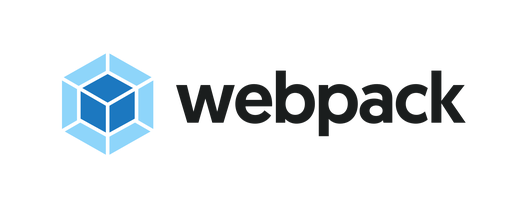

요즘은 라이브러리들이 init cli 를 지원해서 webpack 를 직접 설정 할 일이 별로 없어진거 같긴 하다.

그래도 면접에서 webpack 에 대해서 물어본다면 기본은 알아야 하지 않을까 싶어서 개념에 대해서 정리해 보려고 한다.

webpack 의 핵심 개념은 4 가지(Entry, Output, Loaders, Plugins)라고 한다.

## Entry

모듈로 만들기 위한 시작 지점 파일을 설정하는 것이다.

`webpack.config.js`

```js
module.exports = {
  entry: './app.js'
};

module.exports = config;
```

## Output

하나로 합쳐진 파일을 어떤 위치에 어떤 이름으로 만들 것인지 설정하는 것이다.

* `path` 는 합쳐진 파일이 생성될 위치
* `filename` 은 합쳐진 파일 이름

`webpack.config.js`

```js
const path = require('path');

module.exports = {
  output: {
    path: path.resolve(__dirname, 'dist'),
    filename: 'bundle.js'
  }
};

module.exports = config;
```

이렇게만 설정 파일을 만들어도 `bundle.js` 파일로 만들 수 있다.

```bash
$ npx webpack
Hash: f2ececabf159ee416052
Version: webpack 3.10.0
Time: 80ms
    Asset     Size  Chunks             Chunk Names
bundle.js  2.49 kB       0  [emitted]  main
   [0] ./app.js 19 bytes {0} [built]
```

위와 같이 webpack 을 실행하면 dist 디렉토리에 bundle.js 파일이 생성된다.
npx 는 webpack 을 global 로 설치하지 않고 사용하기 위해서 npx 로 webpack 을 실행했다.

혹은 package.json 파일에 아래와 같이 추가한다.

```json
{
  ...
  "scripts": {
    "build": "webpack"
  }
  ...
}
```

이렇게 하면 dev 로 설치된 webpack 으로 아래와 같이 실행 가능하다.

```bash
$ yarn run build
yarn run v1.3.2
$ webpack
Hash: f2ececabf159ee416052
Version: webpack 3.10.0
Time: 75ms
    Asset     Size  Chunks             Chunk Names
bundle.js  2.49 kB       0  [emitted]  main
   [0] ./app.js 19 bytes {0} [built]
✨  Done in 1.02s.
```

## Loaders

Loader 를 통해서 js 외에 다른 파일들도 import 해서 하나의 파일로 합쳐서 사용할 수 있다.

* `test` 속성은 변환해야 할 파일을 설정한다.
* `use` 속성은 변환을 할 때 사용할 로더를 설정한다.

예를 들면 위와 같이 설정하면 css 파일을 import 해서 사용 가능하다.

다음 두개의 모듈을 설치한다.

```bash
$ yarn add -D style-loader css-loader
```

아래와 같이 설정 파일에 추가한다.

`webpack.config.js`

```js
const path = require('path');

const config = {
  module: {
    rules: [
      {
        test: /\.css$/,
        use: ['style-loader', 'css-loader']
      }
    ]
  }
};

module.exports = config;
```

style.css 파일을 생성하고 다음과 같이 넣는다.

```css
html {
  background: black;
}
```

app.js 파일을 수정해서 style.css 파일을 import 한다.

```js
import './style.css';

function main() {}
```

빌드를 해보면 아래와 같이 style.css 도 포함해서 빌드가 되는걸 확인할 수 있다.

```bash
$ yarn run build
yarn run v1.3.2
$ webpack
Hash: 0f69c9f2652e5166de0d
Version: webpack 3.10.0
Time: 769ms
    Asset     Size  Chunks             Chunk Names
bundle.js  19.5 kB       0  [emitted]  main
   [0] ./app.js 42 bytes {0} [built]
   [1] ./style.css 1.07 kB {0} [built]
   [2] ./node_modules/css-loader!./style.css 191 bytes {0} [built]
    + 3 hidden modules
✨  Done in 1.65s.
```

* [Loaders](https://webpack.js.org/loaders/)

위 링크를 보면 다양한 loader 를 확인할 수 있다.
필요한 loader 를 설치하고 설정 파일에 추가하면 사용 가능하다.

## Plugins

`plugins` 에는 최적화 및 압축에서부터 환경과 유사한 변수 정의 등 다양한 작업을 처리하는데 사용한다.

다음과 같이 설정 파일에 추가해준다.

`webpack.config.js`

```js
const webpack = require('webpack');

const config = {
  plugins: [new webpack.optimize.UglifyJsPlugin()]
};

module.exports = config;
```

위와 같이 설정하면 `bundle.js` 생성할 때 unglify 가 적용되어서 파일의 용량을 줄일 수 있다.

* [Plugins](https://webpack.js.org/plugins/)
* [GitHub - webpack-contrib/awesome-webpack: A curated list of awesome Webpack resources, libraries and tools](https://github.com/webpack-contrib/awesome-webpack#webpack-plugins)

위 링크를 보면 다양한 plugins 를 확인할 수 있다.
webpack 자체에서 지원하는 plugin 도 있지만 다른 사람들이 만들어논 plugin 도 다양하다.
필요한 plugin 을 설치하고 설정 파일에 추가하면 사용 가능하다.
