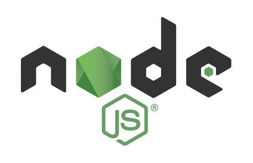

요즘은 기술면접 전에 알고리즘 코딩 테스트를 하는게 일반적인 면접 과정인거 같다.

그래서 [Baekjoon Online Judge](https://www.acmicpc.net/) 에서 알고리즘 공부를 꾸준히 해볼까 한다.

첫번째 문제 “Hello World!”를 출력 하는 문제를 풀고 두번째 문제를 풀려고 했는데 입력값을 두개 받아서 처리 하고 출력해야 하는 문제 였다.

근데 입력을 어떻게 받는건지 모르겠어서 검색해보니 Node.js 의 [Readline](https://nodejs.org/api/readline.html)을 사용해서 가능하다는 걸 알게 되었다.

코드는 다음과 같다.

```js
const readline = require('readline');

const rl = readline.createInterface({
  input: process.stdin,
  output: process.stdout
});

rl.question('What do you think of Node.js? ', answer => {
  console.log(`Thank you for your valuable feedback: ${answer}`);

  rl.close();
});
```

위와 같이 하면 `What do you think of Node.js?` 질문이 출력되고 값을 입력하면 answer 매개 변수로 받을 수 있다.

근데 실제로 저렇게 질문을 출력 하지는 않기 때문에 다음과 같이 코드를 작성하면 된다.

```js
const readline = require('readline');

cosnt rl = readline.createInterface({
	input: process.stdin,
	output: process.stdout
});

rl.on('line', function(answer) {
	console.log(answer);
	rl.close();
});
```

이제 입력된 값으로 처리하는 코드만 작성하면 된다. 오예~
